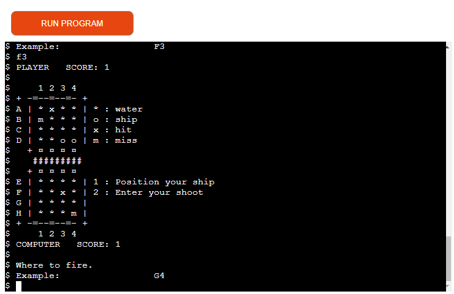
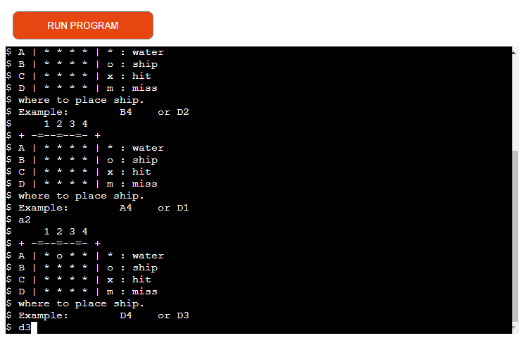

# Battleship v2 
This is my take on a terminal game. This game plays YOU vs COMPUTER and the computer does not have any more logic than random.
The game will go on until all ships on one side is down. You will get noticed for hits, misses, and scores.  

### Web Terminal

# Python Libraries
- random
- re
- os
- Counter

#### Random
The random generator is being used to generate a random integer and to randomly choose an item in a list. 

#### Regular expression operations (re)
re is used to split the input data letter and number example: b3. to 'b' and '3'.

    - r = re.compile("([a-dA-D]+)([1-4]+)")
    - m = r.match(input_player)

    - ship_row = m.group(1).upper()
    - ship_col = m.group(2)

This makes it more convenient to play.

#### Miscellaneous operating system interfaces (os)
os is used when the game is played on the terminal (not the web terminal).
It clears the terminal after new data and then prints out the new data.
By doing this the game stays in the same place and looks cleaner.

#### collections (Counter)
This game use Counter instead of using for-loops to find objects in the list of dictionaries.

## Features 
The game contains two acts:
- setting battleships on your board
- fire at any board

The game contains two 4 X 4 matrices, the top one is yours and is named PLAYER.
The other one is for the computer. Besides the matrices, there are some extra to make the user interface more attractive.

To set your ship you simply type the coordinates "letter" followed by a "number".
- Example, to set your first ship, type b2 or A1.
You can only set one ship at a time and the coordinates need to be a letter followed by a number. 

If you run the game in a terminal, the board will stay in the same place but this function does not work on the web terminal. 
Right now this setting is set for mac or Linux but you can simply change it by setting the: 
- os.system('cls') to os.system('clear')
There are five "errors".

close or refresh the website for quitting or replay it.

### Features Left to Implement

There are a lot of interesting things that can be implemented in this game. 
- ship takes up more space in longitude and latitude
- the computer has a more complex logic
- GUI instead of UI
- attack power can change
- logic on where enemies are hiding 
- game cant crash   
## Testing 
The game has crashed due to some type of input, not certain why but most other "wrong input data" will not crash the game.

The code has 4 pep8 complaints, 3 of them are due to long code, and the last is due to the "continuation line with the same indent as next logical line"
This can only be solved by shorting names to the cost of having names that are too compressed to easily read the meaning.
There I decided to use the pep8 more as a recommendation in this aspect.

#### Features Left to Implement without any Feature
There is a line between simple code, code, smart code, and complex code. 
Right now this code is more to the simpler side and could be rewritten to smart code. 
An idea is to write in classes with different methods inside especially if the game gets bigger and more logic is being used.

## Upload To Heroku
- login to Heroku
- connect this prepared templet by Code Institute from Github
- setting up configs, Key: PORT, Value: 8000
- using python and node.js
- build script. 

## View Website
[Go to Website](https://drmapower-battleships.herokuapp.com/)